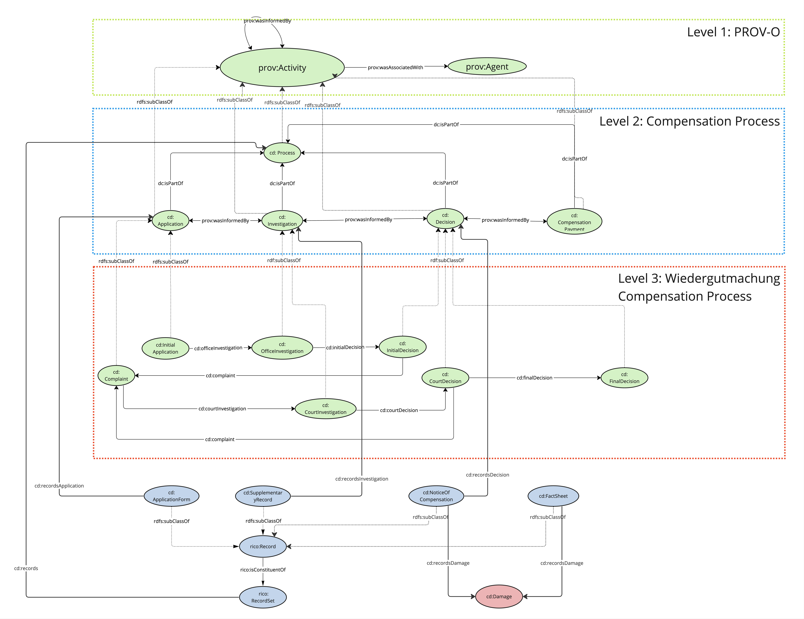

# CourtDocs Ontology
This repository contains materials and results towards developing the CourtDocs Ontology. 

CourtDocs Ontology aims at representing historical court proceedings; it utilises existing vocabularies
and focuses around three central concepts:

• Archival documents record reparation processes and cases, e.g., application form, notice of compensation.

• Legal Processes are activities that are performed to enforce a law, e.g., application, investigation, decision.

• Agents are parties that are involved in a process, e.g., applicants, victims, lawyers, State Offices for Compensation.

The abstract modeling of the court processes of Wiedergutmachung, that is built upon PROV-O, is provided in ProcessModellingCourtDocs.jpg

